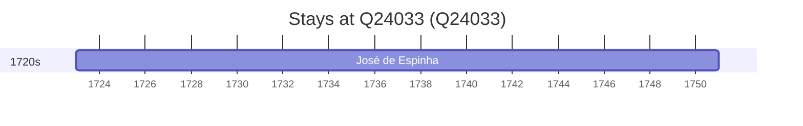

# Q24033

*(fetch error: HTTP Error 429: Too Many Requests)*

Wikidata: [Q24033](https://www.wikidata.org/wiki/Q24033)

1 occurrence(s) across 1 transcribed value(s), 1 person(s).

**Transcribed variants:**

- `Vilar Torpim, diocese de Lamego` (1×, 1722–1722)

| Date | Variant | Person | Type | Entity id | Real entity |
|------|---------|--------|------|-----------|-------------|
| 1722-12-22 | Vilar Torpim, diocese de Lamego | José de Espinha | nascimento | [deh-jose-de-espinha](deh-jose-de-espinha) | — |

