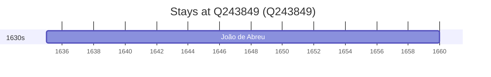

# Q243849

*(fetch error: HTTP Error 429: Too Many Requests)*

Wikidata: [Q243849](https://www.wikidata.org/wiki/Q243849)

2 occurrence(s) across 1 transcribed value(s), 2 person(s).

**Transcribed variants:**

- `Elvas` (2×, 1635–1635)

| Date | Variant | Person | Type | Entity id | Real entity |
|------|---------|--------|------|-----------|-------------|
| — | Elvas | Valentim Stansel | estadia | [deh-valentim-stansel](deh-valentim-stansel) | — |
| 1635 | Elvas | João de Abreu | nascimento | [deh-joao-de-abreu](deh-joao-de-abreu) | — |

