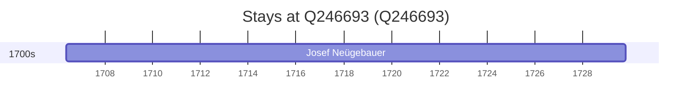

# Q246693

*(fetch error: HTTP Error 429: Too Many Requests)*

Wikidata: [Q246693](https://www.wikidata.org/wiki/Q246693)

1 occurrence(s) across 1 transcribed value(s), 1 person(s).

**Transcribed variants:**

- `Frankenstein, Silésia` (1×, 1706–1706)

| Date | Variant | Person | Type | Entity id | Real entity |
|------|---------|--------|------|-----------|-------------|
| 1706-05-14 | Frankenstein, Silésia | Josef Neügebauer | nascimento | [deh-josef-neugebauer](deh-josef-neugebauer) | — |

