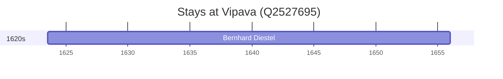

# Vipava (Q2527695)

*town in western Slovenia*

Wikidata: [Q2527695](https://www.wikidata.org/wiki/Q2527695)

1 occurrence(s) across 1 transcribed value(s), 1 person(s).

**Transcribed variants:**

- `Wippach, Carniole` (1×, 1623–1623)

| Date | Variant | Person | Type | Entity id | Real entity |
|------|---------|--------|------|-----------|-------------|
| 1623-07-13 | Wippach, Carniole | Bernhard Diestel | nascimento | [deh-bernhard-diestel](deh-bernhard-diestel) | — |

