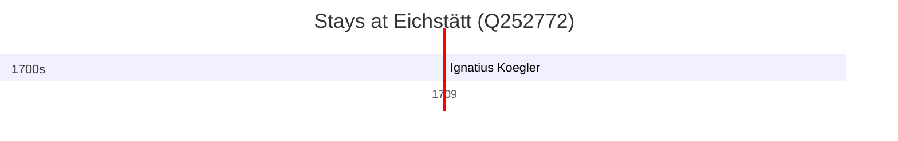

# Eichstätt (Q252772)

*town in Bavaria, Germany*

Wikidata: [Q252772](https://www.wikidata.org/wiki/Q252772)

1 occurrence(s) across 1 transcribed value(s), 1 person(s).

**Transcribed variants:**

- `Eichstätt` (1×, 1709–1709)

| Date | Variant | Person | Type | Entity id | Real entity |
|------|---------|--------|------|-----------|-------------|
| 1709-05-25 | Eichstätt | Ignatius Koegler | jesuita-ordenacao-padre | [deh-ignatius-koegler](deh-ignatius-koegler) | — |

