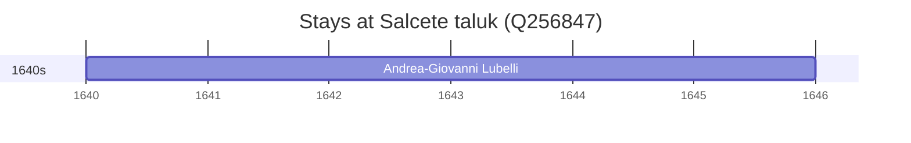

# Salcete taluk (Q256847)

*subdistrict of Goa*

Wikidata: [Q256847](https://www.wikidata.org/wiki/Q256847)

5 occurrence(s) across 2 transcribed value(s), 5 person(s).

**Transcribed variants:**

- `Salcete` (1×, undated)
- `Salcete, Índia` (4×, undated)

| Date | Variant | Person | Type | Entity id | Real entity |
|------|---------|--------|------|-----------|-------------|
| — | Salcete, Índia | António Gomes | estadia | [deh-antonio-gomes](deh-antonio-gomes) | — |
| — | Salcete | Francesco Leonardo Cinamo | estadia | [deh-francesco-leonardo-cinamo](deh-francesco-leonardo-cinamo) | — |
| — | Salcete, Índia | João Cabral | estadia | [deh-joao-cabral](deh-joao-cabral) | — |
| — | Salcete, Índia | Luís da Gama | estadia | [deh-luis-da-gama](deh-luis-da-gama) | — |
| >1640:1643 | Salcete, Índia | Andrea-Giovanni Lubelli | estadia | [deh-andrea-giovanni-lubelli](deh-andrea-giovanni-lubelli) | — |

