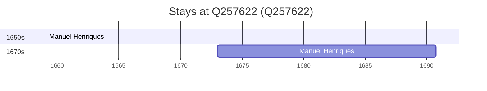

# Q257622

*(fetch error: HTTP Error 429: Too Many Requests)*

Wikidata: [Q257622](https://www.wikidata.org/wiki/Q257622)

2 occurrence(s) across 1 transcribed value(s), 1 person(s).

**Transcribed variants:**

- `Bandra, Índia` (2×, 1659–1673)

| Date | Variant | Person | Type | Entity id | Real entity |
|------|---------|--------|------|-----------|-------------|
| 1659-02-02 | Bandra, Índia | Manuel Henriques | jesuita-votos-local | [deh-manuel-henriques](deh-manuel-henriques) | — |
| 1673 | Bandra, Índia | Manuel Henriques | estadia | [deh-manuel-henriques](deh-manuel-henriques) | — |

