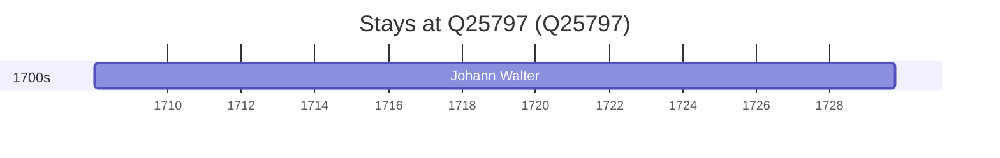

# Q25797

*(fetch error: HTTP Error 429: Too Many Requests)*

Wikidata: [Q25797](https://www.wikidata.org/wiki/Q25797)

1 occurrence(s) across 1 transcribed value(s), 1 person(s).

**Transcribed variants:**

- `Žilina, Eslováquia` (1×, 1708–1708)

| Date | Variant | Person | Type | Entity id | Real entity |
|------|---------|--------|------|-----------|-------------|
| 1708-01-06 | Žilina, Eslováquia | Johann Walter | nascimento | [deh-johann-walter](deh-johann-walter) | — |

