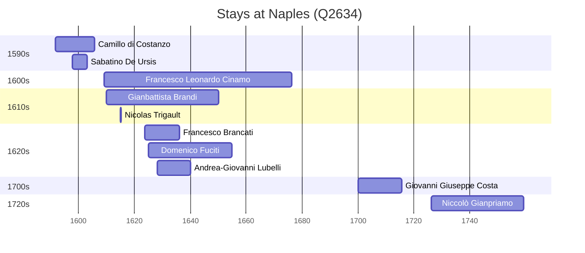

# Naples (Q2634)

*capital city of Campania, Italy*

Wikidata: [Q2634](https://www.wikidata.org/wiki/Q2634)

15 occurrence(s) across 2 transcribed value(s), 10 person(s).

**Transcribed variants:**

- `Nápoles` (14×, 1591–1759)
- `Nápoles (casa professa)` (1×, 1643–1643)

| Date | Variant | Person | Type | Entity id | Real entity |
|------|---------|--------|------|-----------|-------------|
| 1591-09-08 | Nápoles | Camillo di Costanzo | jesuita-entrada | [deh-camillo-di-costanzo](deh-camillo-di-costanzo) | — |
| 1597-11-06 | Nápoles | Sabatino De Ursis | jesuita-entrada | [deh-sabatino-de-ursis](deh-sabatino-de-ursis) | — |
| 1609 | Nápoles | Francesco Leonardo Cinamo | nascimento | [deh-francesco-leonardo-cinamo](deh-francesco-leonardo-cinamo) | — |
| 1610 | Nápoles | Gianbattista Brandi | nascimento | [deh-gianbattista-brandi](deh-gianbattista-brandi) | — |
| 1623-08-14 | Nápoles | Francesco Brancati | jesuita-entrada | [deh-francesco-brancati](deh-francesco-brancati) | — |
| 1623-10-13 | Nápoles | Francesco Leonardo Cinamo | jesuita-entrada | [deh-francesco-leonardo-cinamo](deh-francesco-leonardo-cinamo) | — |
| 1625 | Nápoles | Domenico Fuciti | nascimento | [deh-domenico-fuciti](deh-domenico-fuciti) | — |
| 1627-08-18 | Nápoles | Gianbattista Brandi | jesuita-entrada | [deh-gianbattista-brandi](deh-gianbattista-brandi) | — |
| 1628-03-30 | Nápoles | Andrea-Giovanni Lubelli | jesuita-entrada | [deh-andrea-giovanni-lubelli](deh-andrea-giovanni-lubelli) | — |
| 1638-11-10 | Nápoles | Domenico Fuciti | jesuita-entrada | [deh-domenico-fuciti](deh-domenico-fuciti) | — |
| 1643-01-01 | Nápoles (casa professa) | Francesco Leonardo Cinamo | jesuita-votos-local | [deh-francesco-leonardo-cinamo](deh-francesco-leonardo-cinamo) | — |
| 1700-03-11 | Nápoles | Giovanni Giuseppe Costa | jesuita-entrada | [deh-giovanni-giuseppe-costa](deh-giovanni-giuseppe-costa) | — |
| 1726-05-04 | Nápoles | Niccolò Gianpriamo | estadia | [deh-niccolo-gianpriamo](deh-niccolo-gianpriamo) | — |
| 1759-04-14 | Nápoles | Niccolò Gianpriamo | morte | [deh-niccolo-gianpriamo](deh-niccolo-gianpriamo) | — |
| <1615-01-28 | Nápoles | Nicolas Trigault | estadia | [deh-nicolas-trigault](deh-nicolas-trigault) | — |

### Co-presence

These persons were plausibly at this place during overlapping periods (interval estimation from stay dates; rough — see method note below).

| Period | Persons |
|--------|---------|
| 1590s | [Camillo di Costanzo](deh-camillo-di-costanzo), [Sabatino De Ursis](deh-sabatino-de-ursis) |
| 1610s | [Francesco Leonardo Cinamo](deh-francesco-leonardo-cinamo), [Gianbattista Brandi](deh-gianbattista-brandi), [Nicolas Trigault](deh-nicolas-trigault) |
| 1620s | [Andrea-Giovanni Lubelli](deh-andrea-giovanni-lubelli), [Domenico Fuciti](deh-domenico-fuciti), [Francesco Brancati](deh-francesco-brancati), [Francesco Leonardo Cinamo](deh-francesco-leonardo-cinamo), [Gianbattista Brandi](deh-gianbattista-brandi) |

*13 overlapping pair(s) involving 8 person(s). Method: interval start = stay event date; end = next embarque/partida/different-place event, or death, or +15yr cap.*

