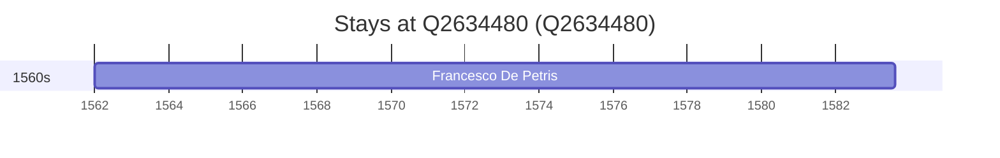

# Q2634480

*(fetch error: HTTP Error 429: Too Many Requests)*

Wikidata: [Q2634480](https://www.wikidata.org/wiki/Q2634480)

1 occurrence(s) across 1 transcribed value(s), 1 person(s).

**Transcribed variants:**

- `Badia di Farfa` (1×, 1562–1562)

| Date | Variant | Person | Type | Entity id | Real entity |
|------|---------|--------|------|-----------|-------------|
| 1562 | Badia di Farfa | Francesco De Petris | nascimento | [deh-francesco-de-petris](deh-francesco-de-petris) | — |

