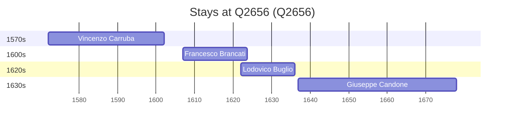

# Q2656

*(fetch error: HTTP Error 429: Too Many Requests)*

Wikidata: [Q2656](https://www.wikidata.org/wiki/Q2656)

5 occurrence(s) across 1 transcribed value(s), 4 person(s).

**Transcribed variants:**

- `Palermo` (5×, 1572–1652)

| Date | Variant | Person | Type | Entity id | Real entity |
|------|---------|--------|------|-----------|-------------|
| 1572 | Palermo | Vincenzo Carruba | nascimento | [deh-vincenzo-carruba](deh-vincenzo-carruba) | — |
| 1607 | Palermo | Francesco Brancati | nascimento | [deh-francesco-brancati](deh-francesco-brancati) | — |
| 1622 | Palermo | Lodovico Buglio | jesuita-entrada | [deh-lodovico-buglio](deh-lodovico-buglio) | — |
| 1636-10-30 | Palermo | Giuseppe Candone | nascimento | [deh-giuseppe-candone](deh-giuseppe-candone) | — |
| 1652-02-01 | Palermo | Giuseppe Candone | jesuita-entrada | [deh-giuseppe-candone](deh-giuseppe-candone) | — |

### Co-presence

These persons were plausibly at this place during overlapping periods (interval estimation from stay dates; rough — see method note below).

| Period | Persons |
|--------|---------|
| 1620s | [Francesco Brancati](deh-francesco-brancati), [Lodovico Buglio](deh-lodovico-buglio) |

*1 overlapping pair(s) involving 2 person(s). Method: interval start = stay event date; end = next embarque/partida/different-place event, or death, or +15yr cap.*

