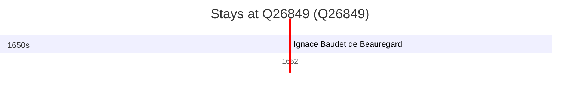

# Q26849

*(fetch error: HTTP Error 429: Too Many Requests)*

Wikidata: [Q26849](https://www.wikidata.org/wiki/Q26849)

1 occurrence(s) across 1 transcribed value(s), 1 person(s).

**Transcribed variants:**

- `Vienne, Dauphiné` (1×, 1652–1652)

| Date | Variant | Person | Type | Entity id | Real entity |
|------|---------|--------|------|-----------|-------------|
| 1652-11-01 | Vienne, Dauphiné | Ignace Baudet de Beauregard | jesuita-votos-local | [deh-ignace-baudet-de-beauregard](deh-ignace-baudet-de-beauregard) | — |

