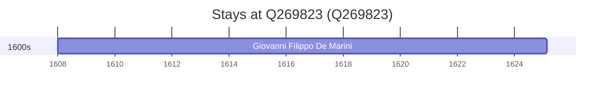

# Q269823

*(fetch error: HTTP Error 429: Too Many Requests)*

Wikidata: [Q269823](https://www.wikidata.org/wiki/Q269823)

1 occurrence(s) across 1 transcribed value(s), 1 person(s).

**Transcribed variants:**

- `Taggia` (1×, 1608–1608)

| Date | Variant | Person | Type | Entity id | Real entity |
|------|---------|--------|------|-----------|-------------|
| 1608 | Taggia | Giovanni Filippo De Marini | nascimento | [deh-giovanni-filippo-de-marini](deh-giovanni-filippo-de-marini) | — |

