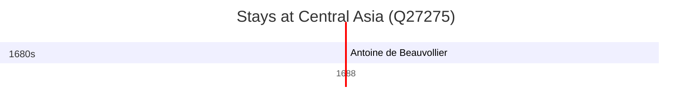

# Central Asia (Q27275)

*subregion of the Asian continent*

Wikidata: [Q27275](https://www.wikidata.org/wiki/Q27275)

1 occurrence(s) across 1 transcribed value(s), 1 person(s).

**Transcribed variants:**

- `Ásia Central` (1×, 1688–1688)

| Date | Variant | Person | Type | Entity id | Real entity |
|------|---------|--------|------|-----------|-------------|
| 1688 | Ásia Central | Antoine de Beauvollier | estadia | [deh-antoine-de-beauvollier](deh-antoine-de-beauvollier) | — |

