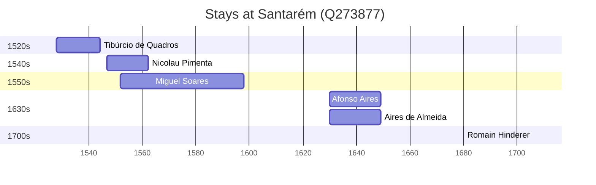

# Santarém (Q273877)

*municipality in Portugal*

Wikidata: [Q273877](https://www.wikidata.org/wiki/Q273877)

6 occurrence(s) across 1 transcribed value(s), 6 person(s).

**Transcribed variants:**

- `Santarém` (6×, 1528–1706)

| Date | Variant | Person | Type | Entity id | Real entity |
|------|---------|--------|------|-----------|-------------|
| 1528 | Santarém | Tibúrcio de Quadros | nascimento | [deh-tiburcio-de-quadros](deh-tiburcio-de-quadros) | — |
| 1546-12-06 | Santarém | Nicolau Pimenta | nascimento | [deh-nicolau-pimenta](deh-nicolau-pimenta) | — |
| 1552 | Santarém | Miguel Soares | nascimento | [deh-miguel-soares](deh-miguel-soares) | — |
| 1630 | Santarém | Afonso Aires | nascimento | [deh-afonso-aires](deh-afonso-aires) | — |
| 1630 | Santarém | Aires de Almeida | nascimento | [deh-afonso-aires-ref1](deh-afonso-aires-ref1) | — |
| 1706-02-02 | Santarém | Romain Hinderer | jesuita-votos-local | [deh-romain-hinderer](deh-romain-hinderer) | — |

### Co-presence

These persons were plausibly at this place during overlapping periods (interval estimation from stay dates; rough — see method note below).

| Period | Persons |
|--------|---------|
| 1550s | [Miguel Soares](deh-miguel-soares), [Nicolau Pimenta](deh-nicolau-pimenta) |
| 1630s | [Afonso Aires](deh-afonso-aires), [Aires de Almeida](deh-afonso-aires-ref1) |

*2 overlapping pair(s) involving 4 person(s). Method: interval start = stay event date; end = next embarque/partida/different-place event, or death, or +15yr cap.*

