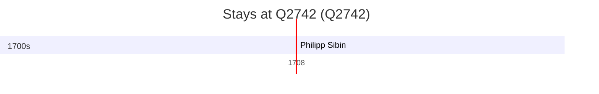

# Q2742

*(fetch error: HTTP Error 429: Too Many Requests)*

Wikidata: [Q2742](https://www.wikidata.org/wiki/Q2742)

1 occurrence(s) across 1 transcribed value(s), 1 person(s).

**Transcribed variants:**

- `Münster, Westphalia` (1×, 1708–1708)

| Date | Variant | Person | Type | Entity id | Real entity |
|------|---------|--------|------|-----------|-------------|
| 1708 | Münster, Westphalia | Philipp Sibin | jesuita-ordenacao-padre | [deh-philipp-sibin](deh-philipp-sibin) | — |

