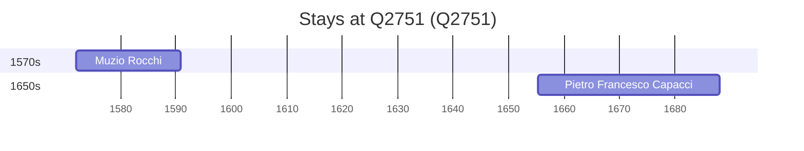

# Q2751

*(fetch error: HTTP Error 429: Too Many Requests)*

Wikidata: [Q2751](https://www.wikidata.org/wiki/Q2751)

2 occurrence(s) across 1 transcribed value(s), 2 person(s).

**Transcribed variants:**

- `Siena` (2×, 1572–1655)

| Date | Variant | Person | Type | Entity id | Real entity |
|------|---------|--------|------|-----------|-------------|
| 1572 | Siena | Muzio Rocchi | nascimento | [deh-muzio-rocchi](deh-muzio-rocchi) | — |
| 1655-04-25 | Siena | Pietro Francesco Capacci | nascimento | [deh-pietro-francesco-capacci](deh-pietro-francesco-capacci) | — |

