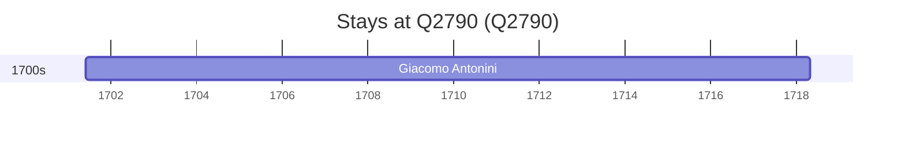

# Q2790

*(fetch error: HTTP Error 429: Too Many Requests)*

Wikidata: [Q2790](https://www.wikidata.org/wiki/Q2790)

1 occurrence(s) across 1 transcribed value(s), 1 person(s).

**Transcribed variants:**

- `Udine` (1×, 1701–1701)

| Date | Variant | Person | Type | Entity id | Real entity |
|------|---------|--------|------|-----------|-------------|
| 1701-05-29 | Udine | Giacomo Antonini | nascimento | [deh-giacomo-antonini](deh-giacomo-antonini) | — |

