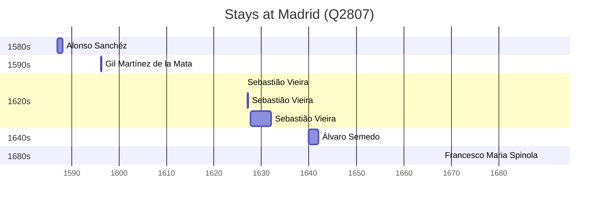

# Madrid (Q2807)

*capital of Spain*

Wikidata: [Q2807](https://www.wikidata.org/wiki/Q2807)

11 occurrence(s) across 1 transcribed value(s), 8 person(s).

**Transcribed variants:**

- `Madrid` (11×, 1587–1737)

| Date | Variant | Person | Type | Entity id | Real entity |
|------|---------|--------|------|-----------|-------------|
| — | Madrid | Gabriel de Matos | chegada | [deh-gabriel-de-matos](deh-gabriel-de-matos) | — |
| — | Madrid | Matias de Sousa | estadia | [deh-matias-de-sousa](deh-matias-de-sousa) | — |
| 1587 | Madrid | Alonso Sanchéz | chegada | [deh-alonso-sanchez](deh-alonso-sanchez) | — |
| 1596-03 | Madrid | Gil Martínez de la Mata | estadia | [deh-gil-martinez-de-la-mata](deh-gil-martinez-de-la-mata) | — |
| 1626-03-25 | Madrid | Sebastião Vieira | estadia | [deh-sebastiao-vieira](deh-sebastiao-vieira) | — |
| 1627-02 | Madrid | Sebastião Vieira | estadia | [deh-sebastiao-vieira](deh-sebastiao-vieira) | — |
| 1627-09 | Madrid | Sebastião Vieira | estadia | [deh-sebastiao-vieira](deh-sebastiao-vieira) | — |
| 1627-11-29 | Madrid | Sebastião Vieira | estadia | [deh-sebastiao-vieira](deh-sebastiao-vieira) | — |
| 1640 | Madrid | Álvaro Semedo | chegada | [deh-alvaro-semedo](deh-alvaro-semedo) | — |
| 1689 | Madrid | Francesco Maria Spinola | estadia | [deh-francesco-maria-spinola](deh-francesco-maria-spinola) | [rp574322](rp574322) |
| 1737-09-02 | Madrid | Louis Jean-Xavier Armand Nyel | morte | [deh-louis-jean-xavier-armand-nyel](deh-louis-jean-xavier-armand-nyel) | — |

