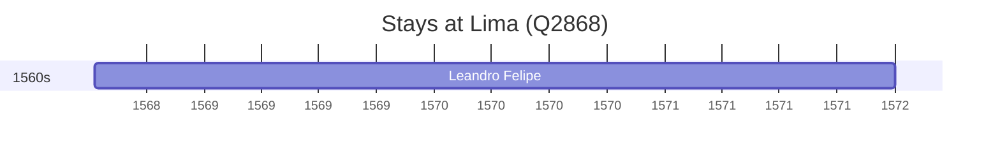

# Lima (Q2868)

*capital and largest city of Peru*

Wikidata: [Q2868](https://www.wikidata.org/wiki/Q2868)

2 occurrence(s) across 1 transcribed value(s), 2 person(s).

**Transcribed variants:**

- `Lima, Peru` (2×, 1568–1568)

| Date | Variant | Person | Type | Entity id | Real entity |
|------|---------|--------|------|-----------|-------------|
| — | Lima, Peru | Louis Jean-Xavier Armand Nyel | estadia | [deh-louis-jean-xavier-armand-nyel](deh-louis-jean-xavier-armand-nyel) | — |
| 1568-07-11 | Lima, Peru | Leandro Felipe | jesuita-entrada | [deh-leandro-felipe](deh-leandro-felipe) | — |

