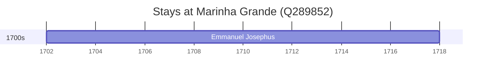

# Marinha Grande (Q289852)

*municipality in Portugal*

Wikidata: [Q289852](https://www.wikidata.org/wiki/Q289852)

1 occurrence(s) across 1 transcribed value(s), 1 person(s).

**Transcribed variants:**

- `Marinha Grande` (1×, 1702–1702)

| Date | Variant | Person | Type | Entity id | Real entity |
|------|---------|--------|------|-----------|-------------|
| 1702 | Marinha Grande | Emmanuel Josephus | nascimento | [deh-manuel-jose-ref2](deh-manuel-jose-ref2) | — |

