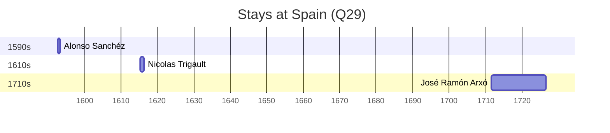

# Spain (Q29)

*country in southwestern Europe with territories in Africa*

Wikidata: [Q29](https://www.wikidata.org/wiki/Q29)

4 occurrence(s) across 1 transcribed value(s), 4 person(s).

**Transcribed variants:**

- `Espanha` (4×, 1592–1624)

| Date | Variant | Person | Type | Entity id | Real entity |
|------|---------|--------|------|-----------|-------------|
| 1592-09-10 | Espanha | Alonso Sanchéz | estadia | [deh-alonso-sanchez](deh-alonso-sanchez) | — |
| 1624-02 | Espanha | Sebastião Vieira | partida | [deh-sebastiao-vieira](deh-sebastiao-vieira) | — |
| >1615-03-26 | Espanha | Nicolas Trigault | estadia | [deh-nicolas-trigault](deh-nicolas-trigault) | — |
| >1708-01-14:<1711-07-29 | Espanha | José Ramón Arxó | estadia | [deh-jose-ramon-arxo](deh-jose-ramon-arxo) | — |

