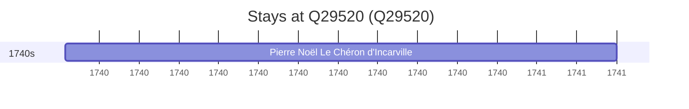

# Q29520

*(fetch error: HTTP Error 429: Too Many Requests)*

Wikidata: [Q29520](https://www.wikidata.org/wiki/Q29520)

1 occurrence(s) across 1 transcribed value(s), 1 person(s).

**Transcribed variants:**

- `China` (1×, 1740–1740)

| Date | Variant | Person | Type | Entity id | Real entity |
|------|---------|--------|------|-----------|-------------|
| 1740-10-10 | China | Pierre Noël Le Chéron d'Incarville | chegada | [deh-pierre-noel-le-cheron-dincarville](deh-pierre-noel-le-cheron-dincarville) | — |

