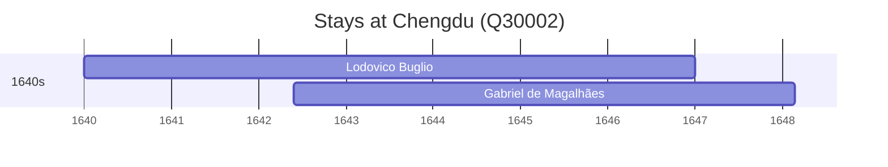

# Chengdu (Q30002)

*capital of Sichuan Province, China*

Wikidata: [Q30002](https://www.wikidata.org/wiki/Q30002)

3 occurrence(s) across 1 transcribed value(s), 2 person(s).

**Transcribed variants:**

- `Chengdu, Sichuan` (3×, 1640–1647)

| Date | Variant | Person | Type | Entity id | Real entity |
|------|---------|--------|------|-----------|-------------|
| 1640 | Chengdu, Sichuan | Lodovico Buglio | estadia | [deh-lodovico-buglio](deh-lodovico-buglio) | — |
| 1642-05-28 | Chengdu, Sichuan | Gabriel de Magalhães | estadia | [deh-gabriel-de-magalhaes](deh-gabriel-de-magalhaes) | [rp695666](rp695666) |
| 1647 | Chengdu, Sichuan | Gabriel de Magalhães | estadia | [deh-gabriel-de-magalhaes](deh-gabriel-de-magalhaes) | [rp695666](rp695666) |

### Co-presence

These persons were plausibly at this place during overlapping periods (interval estimation from stay dates; rough — see method note below).

| Period | Persons |
|--------|---------|
| 1640s | [Gabriel de Magalhães](rp695666), [Lodovico Buglio](deh-lodovico-buglio) |

*1 overlapping pair(s) involving 2 person(s). Method: interval start = stay event date; end = next embarque/partida/different-place event, or death, or +15yr cap.*

