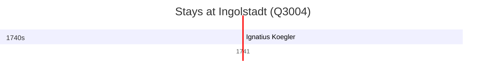

# Ingolstadt (Q3004)

*city in Bavaria, Germany*

Wikidata: [Q3004](https://www.wikidata.org/wiki/Q3004)

1 occurrence(s) across 1 transcribed value(s), 1 person(s).

**Transcribed variants:**

- `Ingolstadt` (1×, 1741–1741)

| Date | Variant | Person | Type | Entity id | Real entity |
|------|---------|--------|------|-----------|-------------|
| 1741-02-02 | Ingolstadt | Ignatius Koegler | jesuita-votos-local | [deh-ignatius-koegler](deh-ignatius-koegler) | — |

