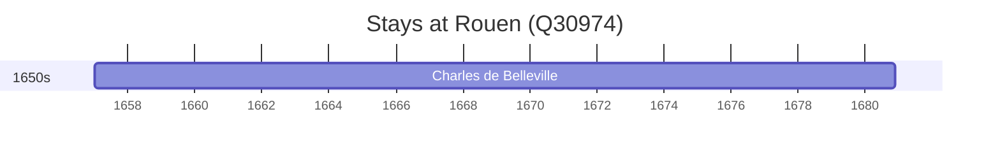

# Rouen (Q30974)

*commune in Seine-Maritime, France*

Wikidata: [Q30974](https://www.wikidata.org/wiki/Q30974)

1 occurrence(s) across 1 transcribed value(s), 1 person(s).

**Transcribed variants:**

- `Rouen` (1×, 1657–1657)

| Date | Variant | Person | Type | Entity id | Real entity |
|------|---------|--------|------|-----------|-------------|
| 1657-01-05 | Rouen | Charles de Belleville | nascimento | [deh-charles-de-belleville](deh-charles-de-belleville) | [rp033271](rp033271) |

