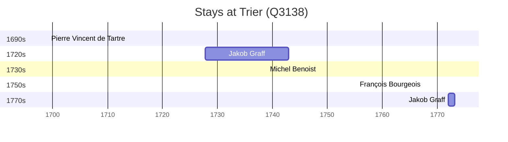

# Trier (Q3138)

*city in Rhineland-Palatinate, Germany*

Wikidata: [Q3138](https://www.wikidata.org/wiki/Q3138)

7 occurrence(s) across 2 transcribed value(s), 4 person(s).

**Transcribed variants:**

- `Trier` (5×, 1699–1773)
- `Trier (noviciado)` (2×, 1772–1773)

| Date | Variant | Person | Type | Entity id | Real entity |
|------|---------|--------|------|-----------|-------------|
| 1699-03-15 | Trier | Pierre Vincent de Tartre | jesuita-ordenacao-padre | [deh-pierre-vincent-de-tartre](deh-pierre-vincent-de-tartre) | — |
| 1727-10-19 | Trier | Jakob Graff | jesuita-entrada | [deh-jakob-graff](deh-jakob-graff) | — |
| 1739 | Trier | Michel Benoist | jesuita-ordenacao-padre | [deh-michel-benoist](deh-michel-benoist) | — |
| 1755-04-10 | Trier | François Bourgeois | jesuita-ordenacao-padre | [deh-francois-bourgeois](deh-francois-bourgeois) | — |
| 1772 | Trier (noviciado) | Jakob Graff | estadia | [deh-jakob-graff](deh-jakob-graff) | — |
| 1773 | Trier (noviciado) | Jakob Graff | estadia | [deh-jakob-graff](deh-jakob-graff) | — |
| 1773-02-28 | Trier | Jakob Graff | morte | [deh-jakob-graff](deh-jakob-graff) | — |

### Co-presence

These persons were plausibly at this place during overlapping periods (interval estimation from stay dates; rough — see method note below).

| Period | Persons |
|--------|---------|
| 1730s | [Jakob Graff](deh-jakob-graff), [Michel Benoist](deh-michel-benoist) |

*1 overlapping pair(s) involving 2 person(s). Method: interval start = stay event date; end = next embarque/partida/different-place event, or death, or +15yr cap.*

