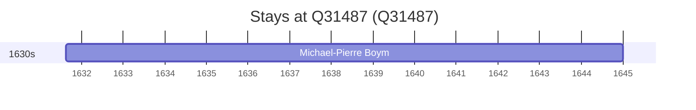

# Q31487

*(fetch error: HTTP Error 429: Too Many Requests)*

Wikidata: [Q31487](https://www.wikidata.org/wiki/Q31487)

1 occurrence(s) across 1 transcribed value(s), 1 person(s).

**Transcribed variants:**

- `Cracóvia` (1×, 1631–1631)

| Date | Variant | Person | Type | Entity id | Real entity |
|------|---------|--------|------|-----------|-------------|
| 1631-08-16 | Cracóvia | Michael-Pierre Boym | jesuita-entrada | [deh-michael-pierre-boym](deh-michael-pierre-boym) | — |

