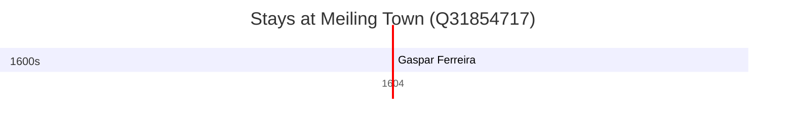

# Meiling Town (Q31854717)

*town in Xinjian, Nanchang, Jiangxi, China*

Wikidata: [Q31854717](https://www.wikidata.org/wiki/Q31854717)

1 occurrence(s) across 1 transcribed value(s), 1 person(s).

**Transcribed variants:**

- `Meiling` (1×, 1604–1604)

| Date | Variant | Person | Type | Entity id | Real entity |
|------|---------|--------|------|-----------|-------------|
| 1604-08 | Meiling | Gaspar Ferreira | estadia | [deh-gaspar-ferreira](deh-gaspar-ferreira) | — |

