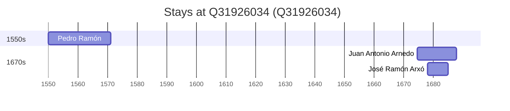

# Q31926034

*(fetch error: HTTP Error 429: Too Many Requests)*

Wikidata: [Q31926034](https://www.wikidata.org/wiki/Q31926034)

3 occurrence(s) across 1 transcribed value(s), 3 person(s).

**Transcribed variants:**

- `Saragoça` (3×, 1550–1677)

| Date | Variant | Person | Type | Entity id | Real entity |
|------|---------|--------|------|-----------|-------------|
| 1550 | Saragoça | Pedro Ramón | nascimento | [deh-pedro-ramon](deh-pedro-ramon) | — |
| 1674-06-13 | Saragoça | Juan Antonio Arnedo | jesuita-entrada | [deh-juan-antonio-arnedo](deh-juan-antonio-arnedo) | [rp780907](rp780907) |
| 1677-11-15 | Saragoça | José Ramón Arxó | jesuita-entrada | [deh-jose-ramon-arxo](deh-jose-ramon-arxo) | — |

### Co-presence

These persons were plausibly at this place during overlapping periods (interval estimation from stay dates; rough — see method note below).

| Period | Persons |
|--------|---------|
| 1670s | [José Ramón Arxó](deh-jose-ramon-arxo), [Juan Antonio Arnedo](rp780907) |

*1 overlapping pair(s) involving 2 person(s). Method: interval start = stay event date; end = next embarque/partida/different-place event, or death, or +15yr cap.*

