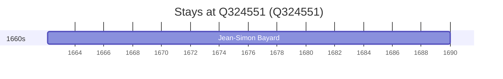

# Q324551

*(fetch error: HTTP Error 429: Too Many Requests)*

Wikidata: [Q324551](https://www.wikidata.org/wiki/Q324551)

1 occurrence(s) across 1 transcribed value(s), 1 person(s).

**Transcribed variants:**

- `Lescar, Béarn (paróquia de St. Julien de Lescar)` (1×, 1662–1662)

| Date | Variant | Person | Type | Entity id | Real entity |
|------|---------|--------|------|-----------|-------------|
| 1662-02-12 | Lescar, Béarn (paróquia de St. Julien de Lescar) | Jean-Simon Bayard | nascimento | [deh-jean-simon-bayard](deh-jean-simon-bayard) | — |

