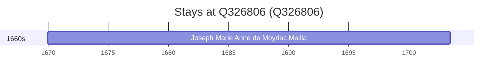

# Q326806

*(fetch error: HTTP Error 429: Too Many Requests)*

Wikidata: [Q326806](https://www.wikidata.org/wiki/Q326806)

1 occurrence(s) across 1 transcribed value(s), 1 person(s).

**Transcribed variants:**

- `Maillac (palácio)` (1×, 1669–1669)

| Date | Variant | Person | Type | Entity id | Real entity |
|------|---------|--------|------|-----------|-------------|
| 1669-12-16 | Maillac (palácio) | Joseph Marie Anne de Moyriac Mailla | nascimento | [deh-joseph-marie-anne-de-moyriac-mailla](deh-joseph-marie-anne-de-moyriac-mailla) | — |

