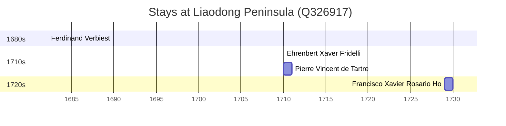

# Liaodong Peninsula (Q326917)

*peninsula*

Wikidata: [Q326917](https://www.wikidata.org/wiki/Q326917)

8 occurrence(s) across 4 transcribed value(s), 8 person(s).

**Transcribed variants:**

- `Leao-tong` (5×, 1682–1711)
- `Liaotong` (1×, 1710–1710)
- `Leaotung` (1×, 1729–1729)
- `Leaotong` (1×, undated)

| Date | Variant | Person | Type | Entity id | Real entity |
|------|---------|--------|------|-----------|-------------|
| — | Leao-tong | Dominique Parrenin | estadia | [deh-dominique-parrenin](deh-dominique-parrenin) | — |
| — | Leao-tong | Jean-Baptiste Régis | estadia | [deh-jean-baptiste-regis](deh-jean-baptiste-regis) | — |
| — | Leaotong | Louis Fan | estadia | [deh-louis-fan](deh-louis-fan) | — |
| 1682-03-23 | Leao-tong | Ferdinand Verbiest | estadia | [deh-ferdinand-verbiest](deh-ferdinand-verbiest) | [rp339905](rp339905) |
| 1710 | Liaotong | Ehrenbert Xaver Fridelli | estadia | [deh-ehrenbert-xaver-fridelli](deh-ehrenbert-xaver-fridelli) | — |
| 1710 | Leao-tong | Pierre Vincent de Tartre | estadia | [deh-pierre-vincent-de-tartre](deh-pierre-vincent-de-tartre) | — |
| 1711 | Leao-tong | Carlos de Resende | partida | [deh-carlos-de-resende](deh-carlos-de-resende) | — |
| 1729 | Leaotung | Francisco Xavier Rosario Ho | estadia | [deh-francisco-xavier-rosario-ho](deh-francisco-xavier-rosario-ho) | [rp419976](rp419976) |

