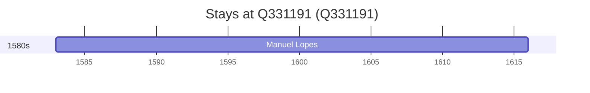

# Q331191

*(fetch error: HTTP Error 429: Too Many Requests)*

Wikidata: [Q331191](https://www.wikidata.org/wiki/Q331191)

1 occurrence(s) across 1 transcribed value(s), 1 person(s).

**Transcribed variants:**

- `Abrantes, diocese da Guarda` (1×, 1583–1583)

| Date | Variant | Person | Type | Entity id | Real entity |
|------|---------|--------|------|-----------|-------------|
| 1583 | Abrantes, diocese da Guarda | Manuel Lopes | nascimento | [deh-manuel-lopes-ref3](deh-manuel-lopes-ref3) | — |

