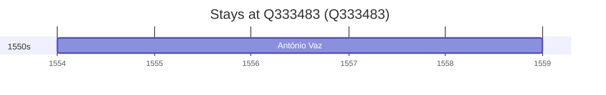

# Q333483

*(fetch error: HTTP Error 429: Too Many Requests)*

Wikidata: [Q333483](https://www.wikidata.org/wiki/Q333483)

2 occurrence(s) across 1 transcribed value(s), 2 person(s).

**Transcribed variants:**

- `Ternate, Indonésia` (2×, 1554–1554)

| Date | Variant | Person | Type | Entity id | Real entity |
|------|---------|--------|------|-----------|-------------|
| — | Ternate, Indonésia | Diogo Pinto | estadia | [deh-diogo-pinto](deh-diogo-pinto) | — |
| 1554 | Ternate, Indonésia | António Vaz | estadia | [deh-antonio-vaz-ref1](deh-antonio-vaz-ref1) | — |

