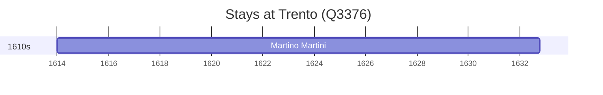

# Trento (Q3376)

*Italian city in the northeast of the country*

Wikidata: [Q3376](https://www.wikidata.org/wiki/Q3376)

1 occurrence(s) across 1 transcribed value(s), 1 person(s).

**Transcribed variants:**

- `Trento` (1×, 1614–1614)

| Date | Variant | Person | Type | Entity id | Real entity |
|------|---------|--------|------|-----------|-------------|
| 1614 | Trento | Martino Martini | nascimento | [deh-martino-martini](deh-martino-martini) | — |

