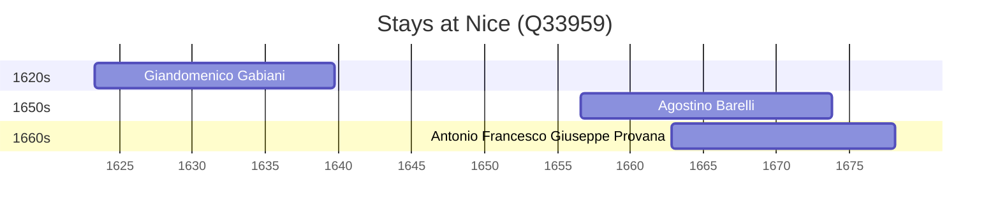

# Nice (Q33959)

*city and commune in Alpes-Maritimes, Provence-Alpes-Côte d'Azur, France*

Wikidata: [Q33959](https://www.wikidata.org/wiki/Q33959)

3 occurrence(s) across 1 transcribed value(s), 3 person(s).

**Transcribed variants:**

- `Nice` (3×, 1623–1662)

| Date | Variant | Person | Type | Entity id | Real entity |
|------|---------|--------|------|-----------|-------------|
| 1623-04-23 | Nice | Giandomenico Gabiani | nascimento | [deh-giandomenico-gabiani](deh-giandomenico-gabiani) | [rp565060](rp565060) |
| 1656-08-09 | Nice | Agostino Barelli | nascimento | [deh-agostino-barelli](deh-agostino-barelli) | — |
| 1662-10-23 | Nice | Antonio Francesco Giuseppe Provana | nascimento | [deh-antonio-francesco-giuseppe-provana](deh-antonio-francesco-giuseppe-provana) | [rp445313](rp445313) |

### Co-presence

These persons were plausibly at this place during overlapping periods (interval estimation from stay dates; rough — see method note below).

| Period | Persons |
|--------|---------|
| 1660s | [Agostino Barelli](deh-agostino-barelli), [Antonio Francesco Giuseppe Provana](rp445313) |

*1 overlapping pair(s) involving 2 person(s). Method: interval start = stay event date; end = next embarque/partida/different-place event, or death, or +15yr cap.*

