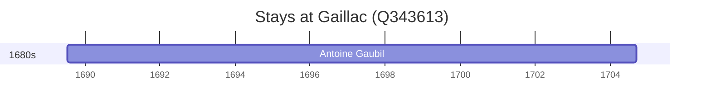

# Gaillac (Q343613)

*commune in Tarn, France*

Wikidata: [Q343613](https://www.wikidata.org/wiki/Q343613)

1 occurrence(s) across 1 transcribed value(s), 1 person(s).

**Transcribed variants:**

- `Gaillac` (1×, 1689–1689)

| Date | Variant | Person | Type | Entity id | Real entity |
|------|---------|--------|------|-----------|-------------|
| 1689-07-14 | Gaillac | Antoine Gaubil | nascimento | [deh-antoine-gaubil](deh-antoine-gaubil) | — |

