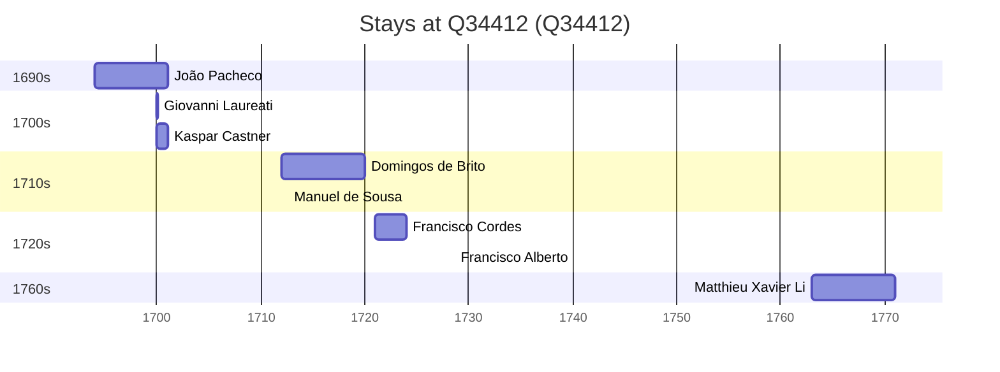

# Q34412

*(fetch error: HTTP Error 429: Too Many Requests)*

Wikidata: [Q34412](https://www.wikidata.org/wiki/Q34412)

16 occurrence(s) across 5 transcribed value(s), 12 person(s).

**Transcribed variants:**

- `Fatshan, Kwangtung` (4×, 1694–1700)
- `Fatshan` (9×, 1700–1763)
- `Fatshan (igreja)` (1×, 1700–1700)
- `Fatshan (igreja de S. José)` (1×, 1712–1712)
- `Fatshan, Fo-chan-tchen, sudeste de Cantão` (1×, 1728–1728)

| Date | Variant | Person | Type | Entity id | Real entity |
|------|---------|--------|------|-----------|-------------|
| — | Fatshan | Carlo Giovanni Turcotti | estadia | [deh-carlo-giovanni-turcotti](deh-carlo-giovanni-turcotti) | — |
| — | Fatshan | Diogo Vidal | estadia | [deh-diogo-vidal](deh-diogo-vidal) | — |
| — | Fatshan | Domingos de Brito | estadia | [deh-domingos-de-brito](deh-domingos-de-brito) | — |
| — | Fatshan, Kwangtung | João de Borgia Kouo | estadia | [deh-joao-de-borgia-kouo](deh-joao-de-borgia-kouo) | — |
| — | Fatshan, Kwangtung | Pietro Francesco Capacci | estadia | [deh-pietro-francesco-capacci](deh-pietro-francesco-capacci) | — |
| 1694 | Fatshan, Kwangtung | João Pacheco | estadia | [deh-joao-pacheco](deh-joao-pacheco) | — |
| 1700 | Fatshan, Kwangtung | Giovanni Laureati | estadia | [deh-giovanni-laureati](deh-giovanni-laureati) | [rp323905](rp323905) |
| 1700 | Fatshan | Kaspar Castner | estadia | [deh-kaspar-castner](deh-kaspar-castner) | — |
| 1700-08-15 | Fatshan (igreja) | Kaspar Castner | jesuita-votos-local | [deh-kaspar-castner](deh-kaspar-castner) | — |
| 1706-10-15 | Fatshan | Carlo Giovanni Turcotti | morte | [deh-carlo-giovanni-turcotti](deh-carlo-giovanni-turcotti) | — |
| 1712 | Fatshan | Domingos de Brito | estadia | [deh-domingos-de-brito](deh-domingos-de-brito) | — |
| 1712-07-31 | Fatshan (igreja de S. José) | Manuel de Sousa | jesuita-votos-local | [deh-manuel-de-sousa](deh-manuel-de-sousa) | — |
| 1721 | Fatshan | Francisco Cordes | estadia | [deh-francisco-de-cordes](deh-francisco-de-cordes) | — |
| 1722-02-22 | Fatshan | Francisco Cordes | jesuita-votos-local | [deh-francisco-de-cordes](deh-francisco-de-cordes) | — |
| 1728-08-15 | Fatshan, Fo-chan-tchen, sudeste de Cantão | Francisco Alberto | jesuita-votos-local | [deh-francisco-alberto](deh-francisco-alberto) | — |
| 1763 | Fatshan | Matthieu Xavier Li | estadia | [deh-matthieu-xavier-li](deh-matthieu-xavier-li) | — |

### Co-presence

These persons were plausibly at this place during overlapping periods (interval estimation from stay dates; rough — see method note below).

| Period | Persons |
|--------|---------|
| 1700s | [Giovanni Laureati](rp323905), [João Pacheco](deh-joao-pacheco), [Kaspar Castner](deh-kaspar-castner) |
| 1710s | [Domingos de Brito](deh-domingos-de-brito), [Manuel de Sousa](deh-manuel-de-sousa) |

*4 overlapping pair(s) involving 5 person(s). Method: interval start = stay event date; end = next embarque/partida/different-place event, or death, or +15yr cap.*

