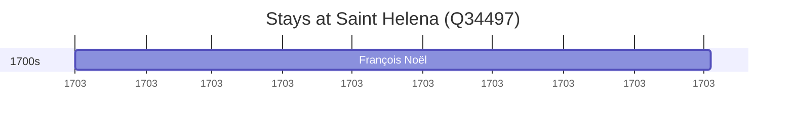

# Saint Helena (Q34497)

*island in the South Atlantic Ocean*

Wikidata: [Q34497](https://www.wikidata.org/wiki/Q34497)

1 occurrence(s) across 1 transcribed value(s), 1 person(s).

**Transcribed variants:**

- `Santa Helena` (1×, 1703–1703)

| Date | Variant | Person | Type | Entity id | Real entity |
|------|---------|--------|------|-----------|-------------|
| 1703 | Santa Helena | François Noël | estadia | [deh-francois-noel](deh-francois-noel) | — |

