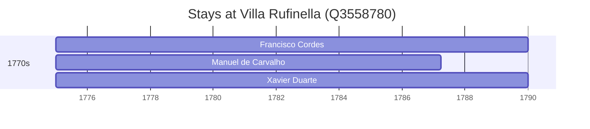

# Villa Rufinella (Q3558780)

*villa in Frascati, Italy*

Wikidata: [Q3558780](https://www.wikidata.org/wiki/Q3558780)

4 occurrence(s) across 2 transcribed value(s), 3 person(s).

**Transcribed variants:**

- `Rufinella, Itália` (3×, 1770–1775)
- `Villa Rufinella` (1×, 1775–1775)

| Date | Variant | Person | Type | Entity id | Real entity |
|------|---------|--------|------|-----------|-------------|
| 1770 | Rufinella, Itália | Francisco Cordes | morte | [deh-francisco-de-cordes](deh-francisco-de-cordes) | — |
| 1775 | Rufinella, Itália | Francisco Cordes | estadia | [deh-francisco-de-cordes](deh-francisco-de-cordes) | — |
| 1775 | Villa Rufinella | Manuel de Carvalho | estadia | [deh-manuel-de-carvalho](deh-manuel-de-carvalho) | — |
| 1775 | Rufinella, Itália | Xavier Duarte | estadia | [deh-xavier-duarte](deh-xavier-duarte) | — |

