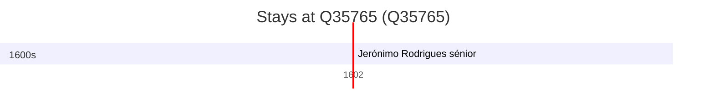

# Q35765

*(fetch error: HTTP Error 429: Too Many Requests)*

Wikidata: [Q35765](https://www.wikidata.org/wiki/Q35765)

1 occurrence(s) across 1 transcribed value(s), 1 person(s).

**Transcribed variants:**

- `Osaka` (1×, 1602–1602)

| Date | Variant | Person | Type | Entity id | Real entity |
|------|---------|--------|------|-----------|-------------|
| 1602-12-08 | Osaka | Jerónimo Rodrigues, sénior | jesuita-votos-local | [deh-jeronimo-rodrigues-senior](deh-jeronimo-rodrigues-senior) | — |

