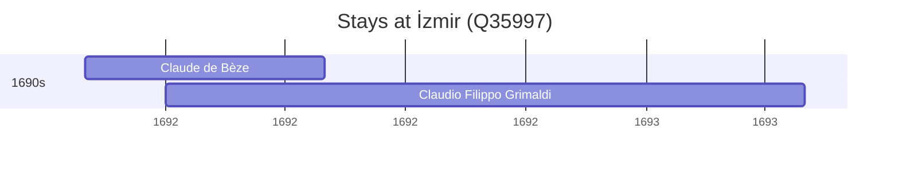

# İzmir (Q35997)

*city in İzmir Province, Turkey*

Wikidata: [Q35997](https://www.wikidata.org/wiki/Q35997)

4 occurrence(s) across 1 transcribed value(s), 4 person(s).

**Transcribed variants:**

- `Esmirna, Pérsia` (4×, 1691–1692)

| Date | Variant | Person | Type | Entity id | Real entity |
|------|---------|--------|------|-----------|-------------|
| — | Esmirna, Pérsia | Johann Grueber | estadia | [deh-johann-grueber](deh-johann-grueber) | — |
| — | Esmirna, Pérsia | Michael-Pierre Boym | estadia | [deh-michael-pierre-boym](deh-michael-pierre-boym) | — |
| 1691-11 | Esmirna, Pérsia | Claude de Bèze | estadia | [deh-claude-de-beze](deh-claude-de-beze) | — |
| 1692 | Esmirna, Pérsia | Claudio Filippo Grimaldi | estadia | [deh-claudio-filippo-grimaldi](deh-claudio-filippo-grimaldi) | — |

### Co-presence

These persons were plausibly at this place during overlapping periods (interval estimation from stay dates; rough — see method note below).

| Period | Persons |
|--------|---------|
| 1690s | [Claude de Bèze](deh-claude-de-beze), [Claudio Filippo Grimaldi](deh-claudio-filippo-grimaldi) |

*1 overlapping pair(s) involving 2 person(s). Method: interval start = stay event date; end = next embarque/partida/different-place event, or death, or +15yr cap.*

