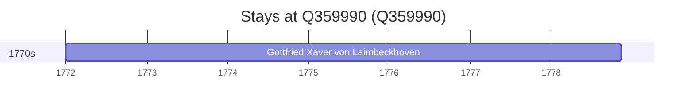

# Q359990

*(fetch error: HTTP Error 429: Too Many Requests)*

Wikidata: [Q359990](https://www.wikidata.org/wiki/Q359990)

1 occurrence(s) across 1 transcribed value(s), 1 person(s).

**Transcribed variants:**

- `Wouho` (1×, 1772–1772)

| Date | Variant | Person | Type | Entity id | Real entity |
|------|---------|--------|------|-----------|-------------|
| 1772 | Wouho | Gottfried Xaver von Laimbeckhoven | estadia | [deh-gottfried-xaver-von-laimbeckhoven](deh-gottfried-xaver-von-laimbeckhoven) | — |

