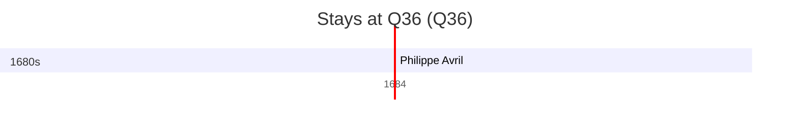

# Q36

*(fetch error: HTTP Error 429: Too Many Requests)*

Wikidata: [Q36](https://www.wikidata.org/wiki/Q36)

1 occurrence(s) across 1 transcribed value(s), 1 person(s).

**Transcribed variants:**

- `Polónia` (1×, undated)

| Date | Variant | Person | Type | Entity id | Real entity |
|------|---------|--------|------|-----------|-------------|
| >1687-01-15:<1689-09-15 | Polónia | Philippe Avril | estadia | [deh-philippe-avril](deh-philippe-avril) | [rp636254](rp636254) |

