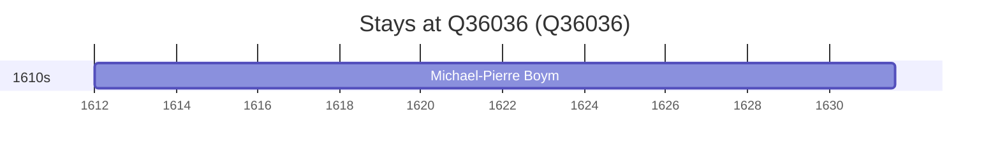

# Q36036

*(fetch error: HTTP Error 429: Too Many Requests)*

Wikidata: [Q36036](https://www.wikidata.org/wiki/Q36036)

1 occurrence(s) across 1 transcribed value(s), 1 person(s).

**Transcribed variants:**

- `Lwów` (1×, 1612–1612)

| Date | Variant | Person | Type | Entity id | Real entity |
|------|---------|--------|------|-----------|-------------|
| 1612 | Lwów | Michael-Pierre Boym | nascimento | [deh-michael-pierre-boym](deh-michael-pierre-boym) | — |

