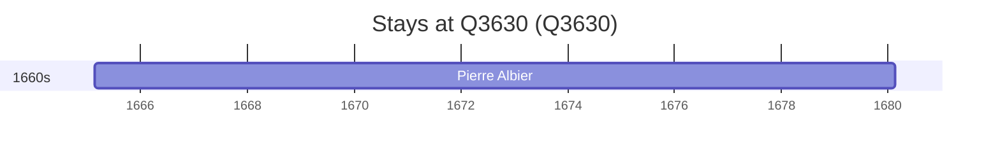

# Q3630

*(fetch error: HTTP Error 429: Too Many Requests)*

Wikidata: [Q3630](https://www.wikidata.org/wiki/Q3630)

1 occurrence(s) across 1 transcribed value(s), 1 person(s).

**Transcribed variants:**

- `Jacarta` (1×, undated)

| Date | Variant | Person | Type | Entity id | Real entity |
|------|---------|--------|------|-----------|-------------|
| <1665-02-20 | Jacarta | Pierre Albier | estadia | [deh-pierre-albier](deh-pierre-albier) | — |

