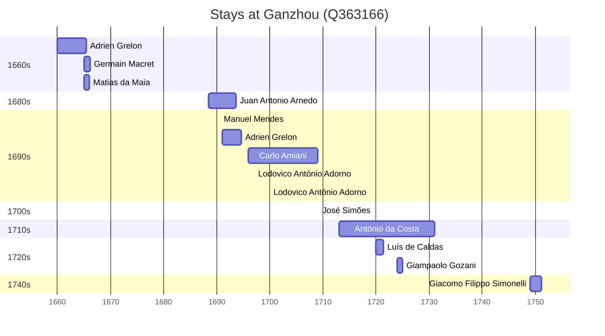

# Ganzhou (Q363166)

*prefecture-level city in Jiangxi, China*

Wikidata: [Q363166](https://www.wikidata.org/wiki/Q363166)

19 occurrence(s) across 10 transcribed value(s), 14 person(s).

**Transcribed variants:**

- `Kanchow (Kan-tcheou) fou, Kiangsi` (1×, 1664–1664)
- `Kanchow (Kan-tcheou) do Kiangsi` (1×, 1665–1665)
- `Kanchow, Kiang-si` (2×, 1671–1749)
- `Kanchow, Kiangxi` (3×, 1688–1707)
- `Kanchow` (6×, 1690–1720)
- `Kanchow, Kiangsi` (2×, 1691–1700)
- `Can cheu (Kanchow)` (1×, 1709–1709)
- `Ganzhou, província de Jiangxi` (1×, 1720–1720)
- `Kanchow do Kiangsi` (1×, 1724–1724)
- `Kanchow (Kan-tcheou fou, Kiangsi)` (1×, undated)

| Date | Variant | Person | Type | Entity id | Real entity |
|------|---------|--------|------|-----------|-------------|
| 1664-12-23 | Kanchow (Kan-tcheou) fou, Kiangsi | Germain Macret | estadia | [deh-germain-macret](deh-germain-macret) | — |
| 1665 | Kanchow (Kan-tcheou) do Kiangsi | Matias da Maia | estadia | [deh-matias-da-maia](deh-matias-da-maia) | — |
| 1671-10-17 | Kanchow, Kiang-si | Claude Motel | morte | [deh-claude-motel](deh-claude-motel) | — |
| 1688-06 | Kanchow, Kiangxi | Juan Antonio Arnedo | estadia | [deh-juan-antonio-arnedo](deh-juan-antonio-arnedo) | [rp780907](rp780907) |
| 1690-08-15 | Kanchow | Manuel Mendes | jesuita-votos-local | [deh-manuel-mendes](deh-manuel-mendes) | [rp352197](rp352197) |
| 1691 | Kanchow, Kiangsi | Adrien Grelon | estadia | [deh-adrien-grelon](deh-adrien-grelon) | — |
| 1696 | Kanchow, Kiangxi | Carlo Amiani | estadia | [deh-carlo-amiani](deh-carlo-amiani) | — |
| 1697-02-02 | Kanchow | Carlo Amiani | jesuita-votos-local | [deh-carlo-amiani](deh-carlo-amiani) | — |
| 1697-02-02 | Kanchow | Lodovico António Adorno | jesuita-votos-local | [deh-ludovico-antonio-adorno](deh-ludovico-antonio-adorno) | — |
| 1700 | Kanchow, Kiangsi | Manuel Osório | partida | [deh-manuel-osorio-i](deh-manuel-osorio-i) | — |
| 1707 | Kanchow, Kiangxi | Carlo Amiani | estadia | [deh-carlo-amiani](deh-carlo-amiani) | — |
| 1709-03-31 | Can cheu (Kanchow) | José Simões | jesuita-votos-local | [deh-jose-simoes](deh-jose-simoes) | — |
| 1713 | Kanchow | António da Costa | estadia | [deh-antonio-da-costa-iii](deh-antonio-da-costa-iii) | — |
| 1720 | Kanchow | António da Costa | estadia | [deh-antonio-da-costa-iii](deh-antonio-da-costa-iii) | — |
| 1720 | Ganzhou, província de Jiangxi | Luís de Caldas | estadia | [deh-luis-de-caldas](deh-luis-de-caldas) | — |
| 1724 | Kanchow do Kiangsi | Giampaolo Gozani | estadia | [deh-giampaolo-gozani](deh-giampaolo-gozani) | — |
| 1749 | Kanchow, Kiang-si | Giacomo Filippo Simonelli | estadia | [deh-giacomo-filippo-simonelli](deh-giacomo-filippo-simonelli) | — |
| >1660 | Kanchow (Kan-tcheou fou, Kiangsi) | Adrien Grelon | estadia | [deh-adrien-grelon](deh-adrien-grelon) | — |
| >1690-04-08:<1695 | Kanchow | Lodovico António Adorno | estadia | [deh-ludovico-antonio-adorno](deh-ludovico-antonio-adorno) | — |

### Co-presence

These persons were plausibly at this place during overlapping periods (interval estimation from stay dates; rough — see method note below).

| Period | Persons |
|--------|---------|
| 1660s | [Adrien Grelon](deh-adrien-grelon), [Germain Macret](deh-germain-macret), [Matias da Maia](deh-matias-da-maia) |
| 1690s | [Adrien Grelon](deh-adrien-grelon), [Carlo Amiani](deh-carlo-amiani), [Juan Antonio Arnedo](rp780907), [Lodovico António Adorno](deh-ludovico-antonio-adorno), [Manuel Mendes](rp352197) |
| 1720s | [António da Costa](deh-antonio-da-costa-iii), [Giampaolo Gozani](deh-giampaolo-gozani), [Luís de Caldas](deh-luis-de-caldas) |

*9 overlapping pair(s) involving 10 person(s). Method: interval start = stay event date; end = next embarque/partida/different-place event, or death, or +15yr cap.*

