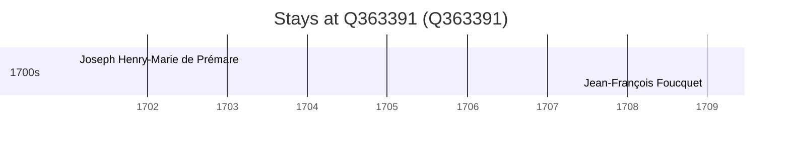

# Q363391

*(fetch error: HTTP Error 429: Too Many Requests)*

Wikidata: [Q363391](https://www.wikidata.org/wiki/Q363391)

2 occurrence(s) across 2 transcribed value(s), 2 person(s).

**Transcribed variants:**

- `Fuchow (Fou-tcheou)` (1×, 1701–1701)
- `Fuchow fou` (1×, 1709–1709)

| Date | Variant | Person | Type | Entity id | Real entity |
|------|---------|--------|------|-----------|-------------|
| 1701-02-02 | Fuchow (Fou-tcheou) | Joseph Henry-Marie de Prémare | jesuita-votos-local | [deh-joseph-henry-marie-de-premare](deh-joseph-henry-marie-de-premare) | — |
| 1709 | Fuchow fou | Jean-François Foucquet | estadia | [deh-jean-francois-foucquet](deh-jean-francois-foucquet) | — |

