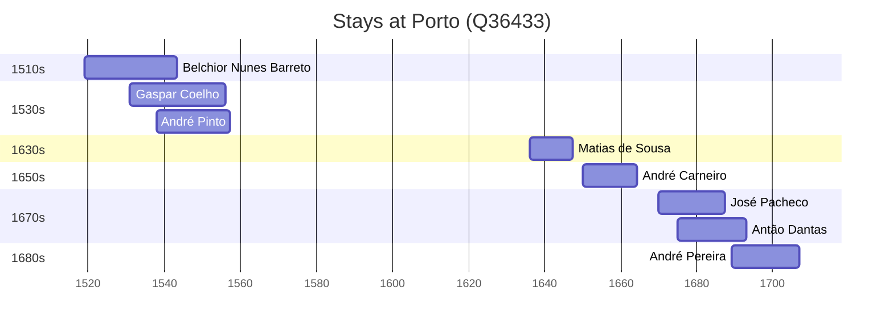

# Porto (Q36433)

*municipality in Portugal*

Wikidata: [Q36433](https://www.wikidata.org/wiki/Q36433)

8 occurrence(s) across 2 transcribed value(s), 8 person(s).

**Transcribed variants:**

- `Porto` (7×, 1519–1689)
- `Porto (colégio)` (1×, 1636–1636)

| Date | Variant | Person | Type | Entity id | Real entity |
|------|---------|--------|------|-----------|-------------|
| 1519 | Porto | Belchior Nunes Barreto | nascimento | [deh-belchior-nunes-barreto](deh-belchior-nunes-barreto) | [rp606650](rp606650) |
| 1531 | Porto | Gaspar Coelho | nascimento | [deh-gaspar-coelho](deh-gaspar-coelho) | — |
| 1538 | Porto | André Pinto | nascimento | [deh-andre-pinto](deh-andre-pinto) | — |
| 1636 | Porto (colégio) | Matias de Sousa | estadia | [deh-matias-de-sousa](deh-matias-de-sousa) | — |
| 1650 | Porto | André Carneiro | nascimento | [deh-andre-carneiro](deh-andre-carneiro) | — |
| 1670 | Porto | José Pacheco | nascimento | [deh-jose-pacheco](deh-jose-pacheco) | — |
| 1674-11-02 | Porto | Antão Dantas | nascimento | [deh-antao-dantas](deh-antao-dantas) | — |
| 1689-02-04 | Porto | André Pereira | nascimento | [deh-andre-pereira](deh-andre-pereira) | — |

### Co-presence

These persons were plausibly at this place during overlapping periods (interval estimation from stay dates; rough — see method note below).

| Period | Persons |
|--------|---------|
| 1530s | [André Pinto](deh-andre-pinto), [Belchior Nunes Barreto](rp606650), [Gaspar Coelho](deh-gaspar-coelho) |
| 1670s | [Antão Dantas](deh-antao-dantas), [José Pacheco](deh-jose-pacheco) |
| 1680s | [André Pereira](deh-andre-pereira), [Antão Dantas](deh-antao-dantas) |

*5 overlapping pair(s) involving 6 person(s). Method: interval start = stay event date; end = next embarque/partida/different-place event, or death, or +15yr cap.*

